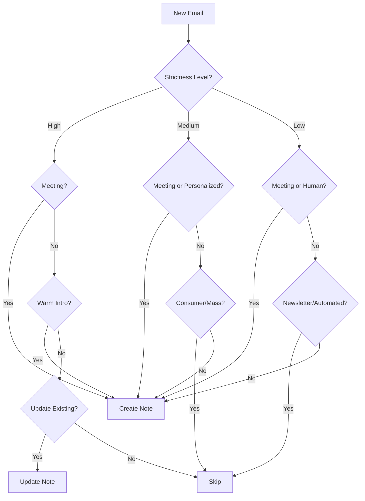

Rowboat's knowledge graph system supports three strictness levels that control how aggressively notes are created from emails. This helps you manage signal vs. noise based on your email volume.

<Info>
**Meetings always create notes** at all strictness levels. Strictness only affects email processing.
</Info>

## Configuration

### Configuration File

Strictness is configured in:

```bash
~/.rowboat/config/note_creation.json
```

<CodeGroup>
```json Default (High)
{
  "strictness": "high",
  "configured": false
}
```

```json Medium
{
  "strictness": "medium",
  "configured": true
}
```

```json Low
{
  "strictness": "low",
  "configured": true
}
```
</CodeGroup>

### Schema Fields

| Field | Type | Required | Description |
|-------|------|----------|-------------|
| `strictness` | string | Yes | One of: `"high"`, `"medium"`, `"low"` |
| `configured` | boolean | Yes | Whether you've explicitly set this (false = using default) |

## Strictness Levels

### High Strictness

**Philosophy:** "Meetings create notes. Emails enrich them."

<Info>
**Best for:** Users with high email volume who want minimal noise
</Info>

**Behavior:**
- ✅ Meetings always create notes
- ✅ Emails can update existing notes (people you've already met)
- ✅ Warm intros from known contacts create notes
- ❌ Emails never create new notes (except warm intros)
- ❌ All other emails are skipped

**Use cases:**
- You get 100+ emails per day
- Most emails are newsletters, automated messages, or cold outreach
- You want your knowledge graph to focus on people you've actually met

### Medium Strictness

**Philosophy:** "Both create notes, but emails require personalized content."

<Info>
**Best for:** Balanced capture of relevant business contacts
</Info>

**Behavior:**
- ✅ Meetings always create notes
- ✅ Personalized business emails create notes
- ✅ Warm intros from anyone create notes
- ❌ Consumer services (Amazon, Netflix, banks) skipped
- ❌ Mass newsletters skipped
- ❌ Generic cold sales skipped
- ❌ Automated/system emails skipped

**Use cases:**
- You get 50-100 emails per day
- Mix of personal and business email
- You want to capture important business contacts automatically
- You don't want noise from consumer services

### Low Strictness

**Philosophy:** "Capture broadly. Never miss a potentially important contact."

<Info>
**Best for:** Users with low email volume who want comprehensive capture
</Info>

**Behavior:**
- ✅ Meetings always create notes
- ✅ Any identifiable human sender creates notes
- ✅ Includes recruiters, sales reps, support staff
- ✅ Includes consumer service contacts
- ❌ Only obvious automated emails and newsletters are skipped

**Use cases:**
- You get fewer than 50 emails per day
- You want to capture every potential contact
- You prefer to have a note you don't need rather than miss someone important

## Decision Matrix

What gets captured at each strictness level?

| Email Type | High | Medium | Low |
|------------|:----:|:------:|:---:|
| **Meetings** | ✅ | ✅ | ✅ |
| **Mass newsletters** | ❌ | ❌ | ❌ |
| **Automated/system emails** | ❌ | ❌ | ❌ |
| **Consumer services**<br/>(Amazon, Netflix, banks) | ❌ | ❌ | ✅ |
| **Generic cold sales** | ❌ | ❌ | ✅ |
| **Recruiters** | ❌ | ❌ | ✅ |
| **Support reps** | ❌ | ❌ | ✅ |
| **Personalized business emails** | ❌* | ✅ | ✅ |
| **Warm intros**<br/>(from known contacts) | ✅ | ✅ | ✅ |

*At High strictness, personalized emails can only **update existing** notes, not create new ones.

## Auto-Configuration

On first run, Rowboat analyzes your email patterns and recommends a strictness level:

<Steps>
  <Step title="Email Analysis">
    Rowboat examines your recent emails to understand:
    - Total volume
    - Number of unique human senders
    - Percentage of consumer services vs. business emails
    - Patterns of cold outreach vs. ongoing conversations
  </Step>

  <Step title="Recommendation Logic">
    Based on analysis:
    
    | Condition | Recommended Level | Reason |
    |-----------|-------------------|--------|
    | More than 100 human senders | **High** | Avoid overload |
    | 50-100 senders | **Medium** | Balanced approach |
    | More than 50% consumer services | **Medium** | Filter noise |
    | Less than 30 senders | **Low** | Comprehensive capture is manageable |
  </Step>

  <Step title="You Decide">
    Rowboat presents the recommendation, but you make the final choice. Set `configured: true` once you've made your decision.
  </Step>
</Steps>

## Choosing Your Strictness Level

### Choose High if:
- ✅ You get 100+ emails per day
- ✅ Most emails are newsletters or automated
- ✅ You primarily meet people before email conversations
- ✅ You want your knowledge graph tightly focused

### Choose Medium if:
- ✅ You get 50-100 emails per day
- ✅ Mix of business and personal email
- ✅ You want to capture relevant business contacts
- ✅ You don't want clutter from consumer services

### Choose Low if:
- ✅ You get fewer than 50 emails per day
- ✅ You want comprehensive contact capture
- ✅ You'd rather have extra notes than miss someone
- ✅ You can handle more notes in your knowledge graph

## Examples

### Example 1: Startup Founder (High Volume)

**Email profile:**
- 200+ emails/day
- Many newsletters, investor updates, cold pitches
- Regular meetings with team, investors, customers

**Recommended:** **High** strictness

**Result:** Knowledge graph focuses on people from meetings. Cold emails don't create noise.

### Example 2: Consultant (Medium Volume)

**Email profile:**
- 60-80 emails/day
- Mix of client work, proposals, networking
- Some cold outreach, occasional consumer emails

**Recommended:** **Medium** strictness

**Result:** Captures real business contacts, filters out noise. Warm intros create notes immediately.

### Example 3: Individual Contributor (Low Volume)

**Email profile:**
- 20-30 emails/day
- Mostly internal team communication
- Occasional external contacts

**Recommended:** **Low** strictness

**Result:** Comprehensive capture of everyone you interact with. Easy to manage the volume.

## Changing Strictness

You can change your strictness level at any time:

<Steps>
  <Step title="Edit Configuration">
    Edit `~/.rowboat/config/note_creation.json`:
    
    ```json
    {
      "strictness": "medium",
      "configured": true
    }
    ```
  </Step>

  <Step title="Restart Rowboat">
    Restart Rowboat to apply the new setting.
  </Step>

  <Step title="Existing Notes Unchanged">
    <Warning>
    Changing strictness only affects **future** email processing. Existing notes are not modified or deleted.
    </Warning>
  </Step>
</Steps>

## Technical Details

### Prompt Files

Each strictness level uses a different agent prompt:

```
apps/x/packages/core/src/knowledge/
├── note_creation_high.md      # High strictness rules
├── note_creation_medium.md    # Medium strictness rules
└── note_creation_low.md       # Low strictness rules
```

### Change Detection

Strictness affects which files get processed. The system uses a hybrid approach:

1. **mtime check**: Quick check if file modification time changed
2. **Hash verification**: If mtime changed, compute content hash
3. **Process**: Only if content actually changed

State tracked in:
```
~/.rowboat/knowledge_graph_state.json
```

### Processing Flow



## Troubleshooting

### Too many notes being created

→ Increase strictness level (low → medium → high)

### Missing important contacts

→ Decrease strictness level (high → medium → low)

### Want to reprocess all emails

```bash
# Delete state file to force reprocessing
rm ~/.rowboat/knowledge_graph_state.json
```

<Warning>
Reprocessing all emails can take time and may create duplicate notes if not done carefully.
</Warning>

## Best Practices

1. **Start with recommended**: Let Rowboat analyze your email and suggest a level
2. **Adjust based on results**: After a week, review your knowledge graph and adjust
3. **Consider email habits**: If you aggressively archive/delete, use lower strictness
4. **Review periodically**: Your email patterns may change over time
5. **Reset if needed**: You can always reset and reprocess with different settings

## Related Configuration

- [Models Configuration](/configuration/models) - Configure the LLM used for note creation
- [Google Setup](/configuration/google-setup) - Connect Gmail to enable email processing
