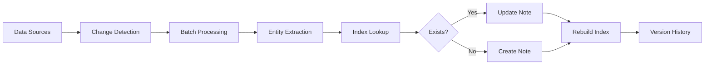

Rowboat's memory compounds over time, creating a rich context that makes interactions more intelligent and personalized. Unlike traditional assistants that forget after each conversation, Rowboat builds lasting knowledge about your work.

## Memory That Compounds

Every interaction with Rowboat contributes to its understanding:

<CardGroup cols={2}>
  <Card title="Automatic Capture" icon="camera">
    Your emails, meetings, and voice memos are automatically processed to extract entities and context
  </Card>
  
  <Card title="Entity Resolution" icon="link">
    Multiple mentions of the same person, project, or organization are merged into a unified note
  </Card>
  
  <Card title="Relationship Mapping" icon="diagram-project">
    Connections between people, organizations, and projects are tracked automatically
  </Card>
  
  <Card title="Temporal Context" icon="clock">
    Rowboat remembers when interactions happened and can understand how relationships evolve
  </Card>
</CardGroup>

## How Memory Builds

### 1. Initial Contact

When Rowboat first encounters someone in your communications:

```markdown
# John Doe

**Email:** john@example.com
**Organization:** [[Acme Corp]]
**Role:** Engineering Manager

## Context

- First met: 2026-01-15 (email thread about API integration)
```

This creates the foundational knowledge about this person.

### 2. Enrichment Over Time

As you continue interacting, the note grows richer:

```markdown
# John Doe

**Email:** john@example.com
**Organization:** [[Acme Corp]]
**Role:** Engineering Manager
**Aliases:** John, JD

## Context

- First met: 2026-01-15 (email thread about API integration)
- Met in person: 2026-01-22 (discussed scaling challenges)
- Working on: [[Project Atlas]]
- Interested in: distributed systems, Kubernetes, observability
- Decision maker for technical architecture
```

### 3. Cross-Referencing

Rowboat automatically links related entities:

<Note>
When John mentions "Project Atlas" in a meeting, Rowboat:
1. Finds or creates a Project Atlas note
2. Links John to the project
3. Links Acme Corp to the project
4. Updates all three notes with this context
</Note>

This creates a web of interconnected knowledge that makes every interaction more informed.

## Entity Merging

Rowboat intelligently handles the same entity appearing in multiple sources:

<Accordion title="Example: Merging Person Notes">
**Email 1 (Jan 15):**
```
From: john@example.com
Re: API Integration
```
Creates: `People/John Doe.md` with email and organization

**Meeting (Jan 22):**
```
Participants: John Doe (Acme), Sarah Chen (Acme)
Topic: Scaling architecture
```
Updates: `People/John Doe.md` with meeting context and interests

**Email 2 (Jan 30):**
```
From: john@example.com  
Re: Project Atlas kickoff
```
Updates: `People/John Doe.md` with Project Atlas link

**Result:** A single comprehensive note about John with all context.
</Accordion>

## Knowledge Index

Rowboat maintains an in-memory index of all entities for fast lookup:

```typescript
interface KnowledgeIndex {
  people: PersonEntry[];
  organizations: OrganizationEntry[];
  projects: ProjectEntry[];
  topics: TopicEntry[];
  other: OtherEntry[];
  buildTime: string;
}
```

This index is used by the AI to:
- Quickly resolve entity mentions
- Avoid creating duplicate notes
- Find related entities for context
- Generate summaries and insights

<Info>
The index is rebuilt before each processing batch to ensure newly created notes are immediately available for merging.
</Info>

## Temporal Awareness

Rowboat tracks when information was captured, enabling:

### Recency Weighting

Recent interactions carry more weight in understanding current context:

- "What's John working on?" → Prioritizes recent emails/meetings
- "Tell me about Project Atlas" → Shows latest status

### Historical Context

Older information provides valuable background:

- "How did we meet Sarah?" → References first contact
- "What projects have we done with Acme?" → Shows complete history

### Evolution Tracking

Rowboat can understand how things change:

- Role changes ("John was promoted to VP")
- Project status ("Atlas went from planning to active")
- Relationship depth ("Met quarterly → now weekly meetings")

## Privacy & Local Storage

All memory is stored locally on your machine:

<CardGroup cols={3}>
  <Card title="Knowledge Base" icon="folder-tree">
    `~/.rowboat/knowledge/`
    
    Your Obsidian-style notes organized by entity type
  </Card>
  
  <Card title="Source Files" icon="file">
    `~/.rowboat/gmail_sync/`
    `~/.rowboat/fireflies_transcripts/`
    `~/.rowboat/granola_notes/`
    
    Raw source data in markdown format
  </Card>
  
  <Card title="State Tracking" icon="database">
    `~/.rowboat/knowledge_graph_state.json`
    
    Processing state for incremental updates
  </Card>
</CardGroup>

**No data ever leaves your machine** unless you explicitly share it.

## Memory Architecture

### Processing Pipeline



### State Management

Rowboat uses a modular state system:

1. **Hybrid change detection** (mtime + hash) identifies new/changed files
2. **Incremental processing** handles files in small batches
3. **Progressive saving** preserves progress after each batch
4. **Git versioning** tracks all changes to notes

This ensures reliable, efficient processing even with thousands of files.

## Practical Examples

### Example 1: Deal Tracking

**Week 1:** Email from sarah@startup.com about partnership

→ Creates `People/Sarah Chen.md` and `Organizations/StartupCo.md`

**Week 2:** Meeting with Sarah and her CTO about integration

→ Updates Sarah's note, creates `People/Alex Kumar.md`, links to `Projects/StartupCo Integration`

**Week 4:** Follow-up emails, contract negotiation

→ Updates project status, tracks decision timeline

**Week 6:** Ask Rowboat "What's the status with StartupCo?"

→ Rowboat synthesizes info from Sarah's note, Alex's note, project note, and recent emails

### Example 2: Conference Connections

You attend a conference and meet 15 people. Over the next week:

1. You have follow-up emails with 8 of them
2. Rowboat creates notes for each person
3. Links them to their organizations
4. Tracks which projects you discussed

Three months later, one of them emails you:

"Rowboat instantly surfaces:"
- When and where you met
- What you discussed
- Their organization and role
- Any follow-ups or commitments

## Versioning & History

Every change to your knowledge base is versioned using Git:

```bash
~/.rowboat/knowledge/.git/
```

<Accordion title="View Version History">
```bash
cd ~/.rowboat/knowledge
git log --oneline

# Example output:
a3f5e9d Knowledge update
b2c4d8e Knowledge update  
c1e3f7g Knowledge update
```

Each commit represents a batch of entity updates with timestamp.
</Accordion>

This provides:
- **Audit trail** of how knowledge evolved
- **Recovery** if something goes wrong
- **Debugging** to understand what changed when

## Source Code Reference

Key implementation files:

- `apps/x/packages/core/src/knowledge/build_graph.ts:162-229` - Entity extraction and merging
- `apps/x/packages/core/src/knowledge/knowledge_index.ts` - Index structure and building
- `apps/x/packages/core/src/knowledge/graph_state.ts` - State management
- `apps/x/packages/core/src/knowledge/version_history.ts` - Git versioning