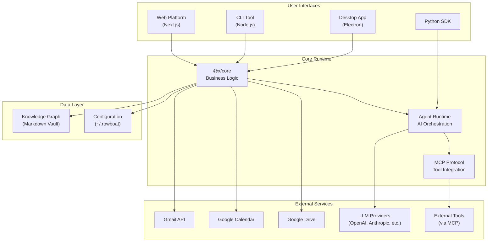

## Architecture Overview

Rowboat is built as a distributed system with multiple interfaces sharing a common core. The architecture enables local-first data storage while providing flexible access through desktop, CLI, SDK, and web interfaces.



## Component Architecture

<Accordion title="Desktop App (apps/x)">
  The Electron desktop application is the primary interface for most users.
  
  ### Structure
  ```
  apps/x/
  ├── apps/
  │   ├── main/              # Electron main process
  │   ├── renderer/          # React UI (Vite)
  │   └── preload/           # Electron preload scripts
  └── packages/
      ├── shared/            # @x/shared - Types, utilities
      └── core/              # @x/core - Business logic
  ```
  
  ### Technology Stack
  - **Desktop Framework:** Electron 39.x
  - **UI:** React 19, Vite 7, TailwindCSS, Radix UI
  - **Build:** TypeScript 5.9, esbuild, Electron Forge
  - **Package Manager:** pnpm (workspace protocol)
  
  ### Build Dependencies
  ```
  shared (no deps)
     ↓
  core (depends on shared)
     ↓
  preload (depends on shared)
     ↓
  renderer (depends on shared)
  main (depends on shared, core)
  ```
  
  <Info>
    The desktop app uses esbuild to bundle everything into a single CommonJS file, eliminating node_modules from the packaged app.
  </Info>
</Accordion>

<Accordion title="Core Package (@x/core)">
  The core package contains the business logic and AI orchestration that powers all interfaces.
  
  ### Key Modules
  
  | Module | Purpose |
  |--------|--------|
  | `agent-schedule/` | Background agent scheduling and execution |
  | `agents/` | Agent definitions and behaviors |
  | `application/` | Application state management |
  | `auth/` | OAuth and authentication flows |
  | `config/` | Configuration management |
  | `knowledge/` | Knowledge graph operations |
  | `mcp/` | Model Context Protocol integration |
  | `models/` | LLM provider abstraction |
  | `runs/` | Agent run history and tracking |
  | `search/` | Search functionality |
  | `workspace/` | Workspace and vault management |
  
  ### AI Stack
  - **Framework:** Vercel AI SDK
  - **Providers:** OpenAI, Anthropic, Google, OpenRouter
  - **Gateway:** Vercel AI Gateway
  - **Local:** Ollama support
  - **Catalog:** models.dev integration
</Accordion>

<Accordion title="CLI Tool (apps/cli)">
  Command-line interface for server and scripting workflows.
  
  ### Features
  - Server mode for API access
  - Agent migration scripts
  - TypeScript-based with Node.js runtime
  - Shares core business logic with desktop app
  
  ### Usage
  ```bash
  rowboatx server          # Start API server
  rowboatx migrate-agents  # Run agent migrations
  ```
</Accordion>

<Accordion title="Python SDK (apps/python-sdk)">
  Python SDK for programmatic access to Rowboat functionality.
  
  ### Key Features
  - Stateless chat API with conversation management
  - Tool override support (mock tools for testing)
  - Type-safe message schemas
  - Error handling and status codes
  
  ### Example Usage
  ```python
  from rowboat.client import Client
  from rowboat.schema import UserMessage
  
  client = Client(
      host="<HOST>",
      projectId="<PROJECT_ID>",
      apiKey="<API_KEY>"
  )
  
  result = client.run_turn(
      messages=[UserMessage(role='user', content="list repos")]
  )
  ```
</Accordion>

<Accordion title="Web Platform (apps/rowboat)">
  Next.js web application for browser-based access.
  
  ### Technology
  - **Framework:** Next.js (React)
  - **Deployment:** Vercel-ready
  - **Features:** Web dashboard, knowledge graph visualization
  
  <Info>
    The web platform provides remote access to your knowledge graph while maintaining local-first principles.
  </Info>
</Accordion>

## Agent Runtime

The agent runtime is the core orchestration layer for AI-powered actions.

<CardGroup cols={2}>
  <Card title="Conversation Management" icon="comments">
    Manages stateful conversations with conversation IDs and message history
  </Card>
  <Card title="Tool Execution" icon="wrench">
    Executes tools via MCP protocol with safety controls and user approval
  </Card>
  <Card title="Background Processing" icon="clock">
    Schedules and runs background agents on configurable intervals
  </Card>
  <Card title="Knowledge Integration" icon="brain">
    Reads and writes to the knowledge graph during agent execution
  </Card>
</CardGroup>

## Data Storage

All user data is stored locally on the machine.

### Knowledge Graph
- **Location:** User-configurable workspace directory
- **Format:** Plain Markdown files with YAML frontmatter
- **Compatibility:** Obsidian-compatible vault structure
- **Linking:** Backlinks using `[[note-name]]` syntax

### Configuration
- **Location:** `~/.rowboat/config/`
- **Files:**
  - `models.json` - LLM provider configuration
  - `models.dev.json` - Model catalog cache
  - `deepgram.json` - Voice transcription API key
  - `brave-search.json` - Web search API key
  - `exa-search.json` - Research search API key

<Info>
  Configuration files use JSON format with clear schemas. No credentials are stored in the codebase.
</Info>

## Model Context Protocol (MCP)

Rowboat uses MCP to connect with external tools and services.

### Architecture
```
Agent Runtime
     ↓
  MCP Client
     ↓
  MCP Servers (one per tool)
     ↓
External Services (GitHub, Slack, Linear, etc.)
```

### Supported Tools
- **Search:** Exa, Brave
- **Social:** Twitter/X
- **Voice:** ElevenLabs
- **Productivity:** Slack, Linear, Jira
- **Development:** GitHub
- **Custom:** Build your own MCP servers

## Security & Privacy

<CardGroup cols={2}>
  <Card title="Local-First" icon="shield">
    All data stored on your machine, not in the cloud
  </Card>
  <Card title="Transparent Storage" icon="eye">
    Plain Markdown files you can inspect, edit, or delete
  </Card>
  <Card title="API Key Control" icon="key">
    You control your own API keys for LLM providers
  </Card>
  <Card title="No Telemetry" icon="ban">
    No tracking or analytics without explicit consent
  </Card>
</CardGroup>

## Development Workflow

### Desktop App Development
```bash
cd apps/x
pnpm install              # Install dependencies
npm run deps              # Build workspace packages
npm run dev               # Start development server
npm run lint              # Lint check
```

### Building for Production
```bash
cd apps/x/apps/main
npm run package           # Build .app
npm run make              # Create DMG distributable
```

<Info>
  Code signing requires `APPLE_ID`, `APPLE_PASSWORD`, and `APPLE_TEAM_ID` environment variables.
</Info>

## Integration Flow

### Google Services Setup
1. User initiates OAuth flow in desktop app
2. Core package handles OAuth via `auth/` module
3. Tokens stored in `~/.rowboat/config/`
4. Core syncs Gmail, Calendar, Drive periodically
5. Data extracted and added to knowledge graph

### Agent Execution Flow
1. User triggers agent (chat, background schedule, or API)
2. Agent runtime loads conversation context
3. Agent queries knowledge graph for relevant notes
4. LLM generates response with tool calls
5. MCP executes tools (with user approval if needed)
6. Results written back to knowledge graph
7. Response returned to user interface

## Performance Considerations

<Accordion title="Build Optimization">
  - esbuild bundles main process to single file
  - Vite optimizes renderer with code splitting
  - pnpm workspace protocol for fast installs
  - TypeScript incremental builds
</Accordion>

<Accordion title="Runtime Optimization">
  - Knowledge graph indexed for fast search
  - LLM responses streamed for better UX
  - Background agents run on configurable schedules
  - Electron IPC for efficient process communication
</Accordion>

## Next Steps

<CardGroup cols={2}>
  <Card title="Development Guide" icon="code" href="/development">
    Learn how to contribute to the codebase
  </Card>
  <Card title="API Reference" icon="book" href="/api-reference">
    Explore the API documentation
  </Card>
  <Card title="Agent Development" icon="robot" href="/agents">
    Build custom agents and workflows
  </Card>
  <Card title="MCP Integration" icon="plug" href="/ai-tools/mcp">
    Connect external tools via MCP
  </Card>
</CardGroup>